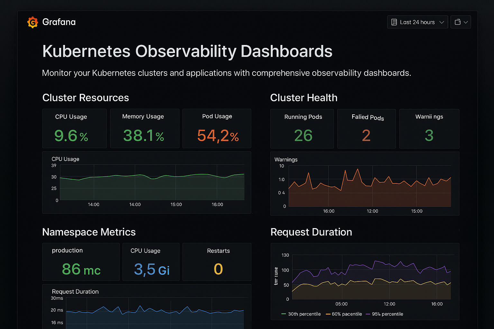
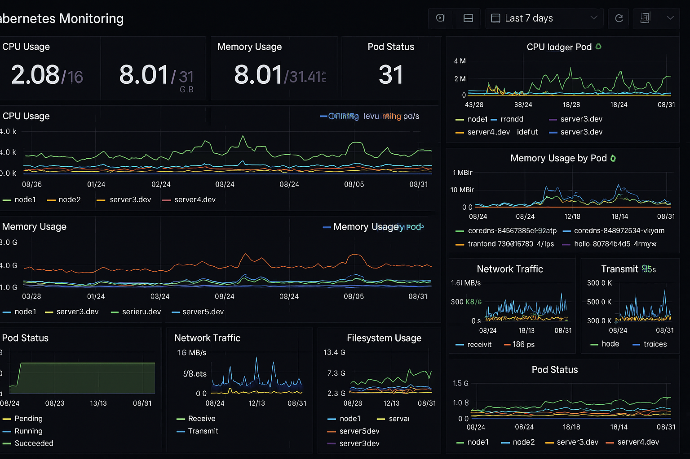
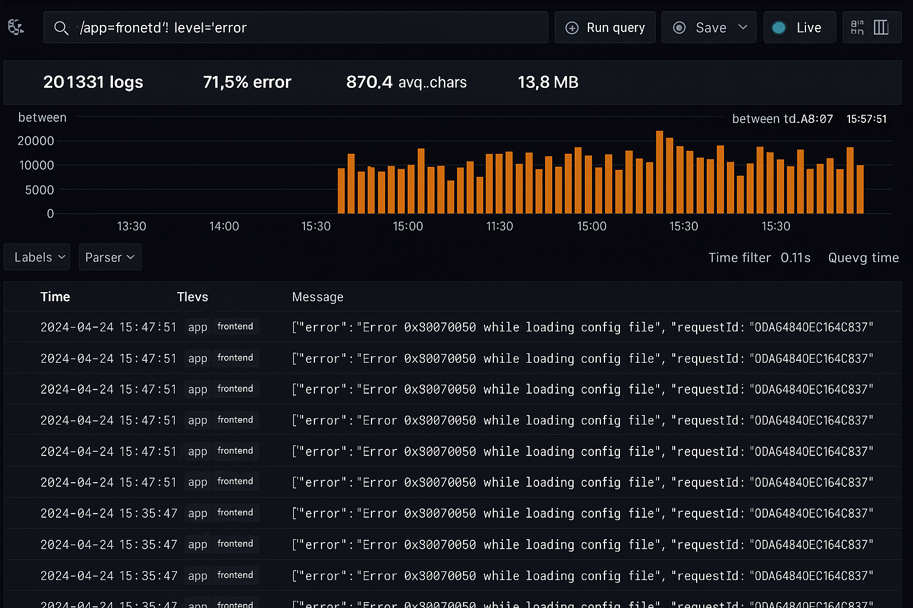
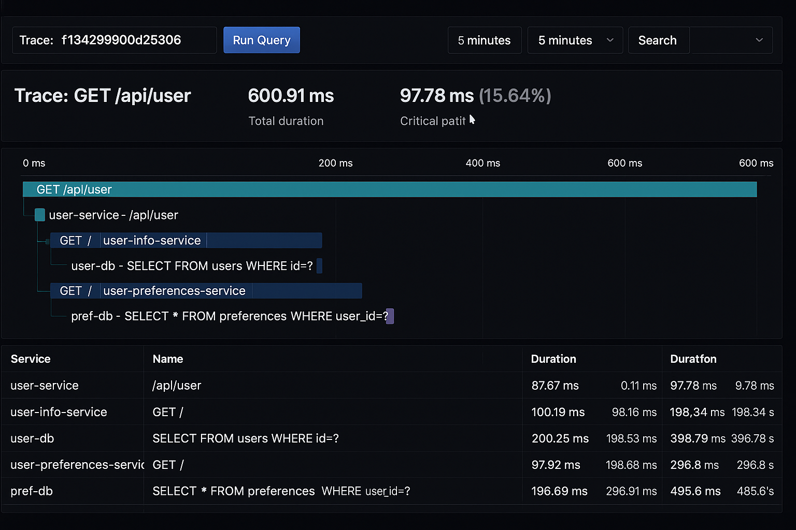

# **Kubernetes Observability Engine**  
*A Complete Monitoring, Logging, and Tracing Solution for Kubernetes Clusters*  

  

## 📌 Overview  

The **Kubernetes Observability Engine** is a production-ready, fully automated observability stack designed to monitor Kubernetes workloads in real-time.  
It integrates **metrics, logs, and traces** into a single cohesive platform using **Prometheus**, **Grafana**, **Loki**, **Tempo**, and **OpenTelemetry** — deployed seamlessly via **Terraform** and **Helm**.  

This project enables teams to:  
- **Visualize cluster health** with rich Grafana dashboards  
- **Centralize logs** across pods and namespaces using Loki  
- **Trace distributed requests** with Tempo + OpenTelemetry  
- **Automate deployment** with Infrastructure-as-Code  

---

## 🚀 Features  

- **Automated Deployment**: Provision the entire stack with Terraform + Helm  
- **Metrics**: Collect CPU, memory, and application metrics via Prometheus  
- **Logging**: Store and query logs with Loki, fully integrated into Grafana  
- **Tracing**: Distributed tracing with Tempo + OpenTelemetry instrumentation  
- **Dashboards**: Pre-built Grafana dashboards for apps and cluster performance  
- **Scalable**: Works for local KIND clusters or cloud-based Kubernetes clusters  

---

## 🏗 Architecture  

```
graph TD
    A[Application Pods] -->|Metrics| B[Prometheus]
    A -->|Logs| C[Loki]
    A -->|Traces| D[Tempo]
    B -->|Visualization| E[Grafana]
    C -->|Visualization| E
    D -->|Visualization| E
```

---

## 📂 Project Structure

```
k8s-observability-engine/
│── terraform/         # Terraform IaC for cluster & resources
│── helm/              # Helm charts for Prometheus, Grafana, Loki, Tempo
│── otel/              # OpenTelemetry configuration
│── dashboards/        # Pre-configured Grafana dashboards
│── scripts/           # Helper scripts for setup and teardown
│── app/               # Sample instrumented FastAPI application
│── README.md
```

---

## ⚙️ Installation

### 1️⃣ Clone the Repository

```
git clone https://github.com/jeshwanthsingh/k8s-observability-engine.git
cd k8s-observability-engine
```

### 2️⃣ Deploy Kubernetes Cluster

```
terraform -chdir=terraform init
terraform -chdir=terraform apply -auto-approve
```

### 3️⃣ Deploy Observability Stack

```
helm upgrade --install prometheus ./helm/prometheus
helm upgrade --install grafana ./helm/grafana
helm upgrade --install loki ./helm/loki
helm upgrade --install tempo ./helm/tempo
```

### 4️⃣ Deploy Sample Application (Optional)

```
kubectl apply -f app/deployment.yaml
```

---

## 📊 Accessing the Dashboards

### 1. Grafana

```
kubectl port-forward svc/grafana 3000:80 -n observability
```

Visit: http://localhost:3000  
Default login: admin / admin

### 2. Pre-Configured Dashboards
- Kubernetes Cluster Overview
- Application Metrics
- Log Search Dashboard
- Distributed Traces Explorer

---

## 🧩 Tech Stack

- **Kubernetes** – Container orchestration
- **Prometheus** – Metrics collection
- **Grafana** – Dashboard visualization
- **Loki** – Centralized logging
- **Tempo** – Distributed tracing
- **OpenTelemetry** – Application instrumentation
- **Terraform** – Infrastructure automation
- **Helm** – Kubernetes package management

---

## 📸 Screenshots

| Metrics Dashboard | Log Explorer | Trace Viewer |
|-------------------|--------------|--------------|
|  |  |  |

---

## 🛠 Development Notes

- Tested on KIND and Minikube
- Works with AWS EKS, GCP GKE, Azure AKS with minor config changes
- Designed for observability-first microservices

---

## 📜 License

This project is licensed under the MIT License.

---


